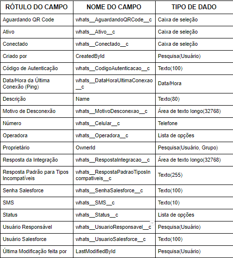
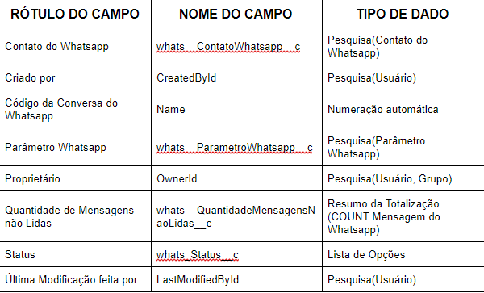
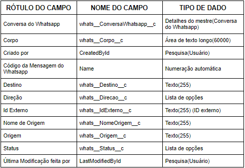

#################
Objetos Personalizados
#################

Contato do Falae
-----------------------
O objeto contato do Falae é criado para ser a referência de um número de Whatsapp de um cliente.

    

Conversa do Falae
-----------------------
O objeto conversa do Falae tem um registro para cada conversa de um contato do Falae com um parâmetro do Falae.

.. Important::
   Referências:
    Acionadores Apex:
      ConversaFalae_aiu
      
      ConversaFalae_biu

Parâmetro Falae
-----------------------
O objeto parâmetro Falae é um registro para os clientes entrarem em contato via Falae.

.. Important::
   Referências:
    Acionadores Apex:
      ParametroFalae_aiu
    Página Visualforce:
      WAQrRequest
    

Mensagem do Falae
-----------------------
O objeto mensagem do Falae contém registrado todas as mensagens enviadas de uma conversa, tanto do cliente para o parâmetro, quanto parâmetro para cliente.

    
  
.. Important::
   Referências:
    Acionadores Apex:
      MensagemFalae_aiu
      
      MensagemFalae_biu
